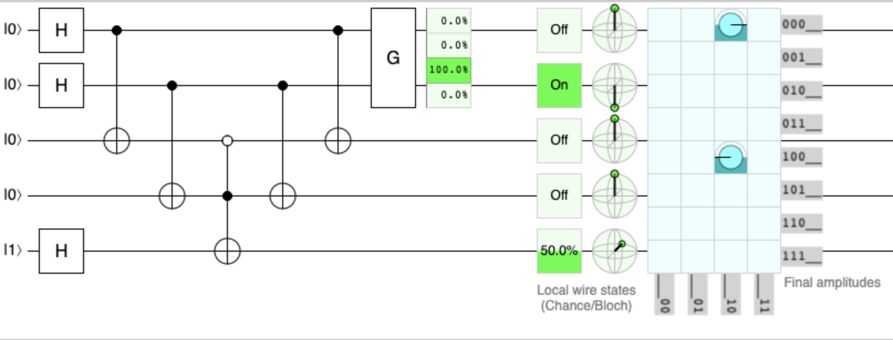
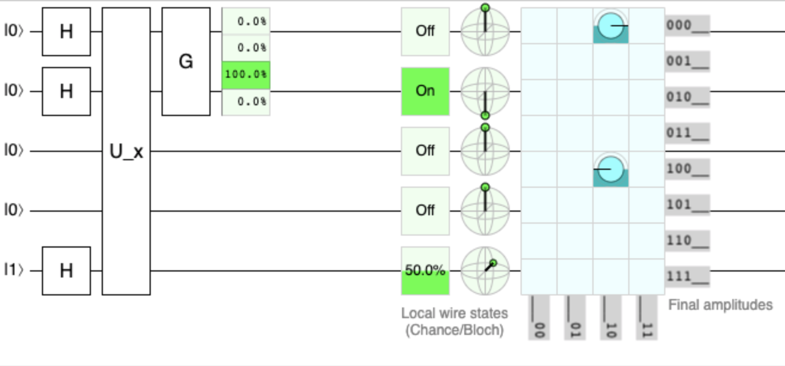
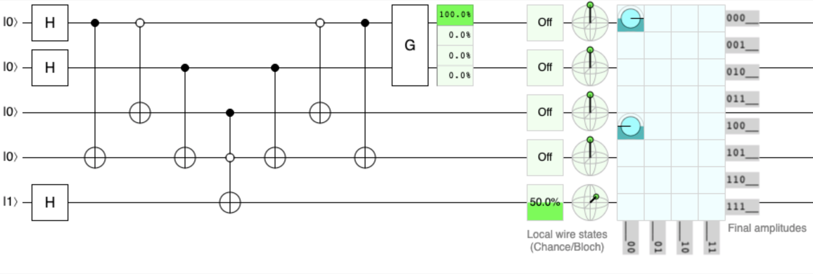
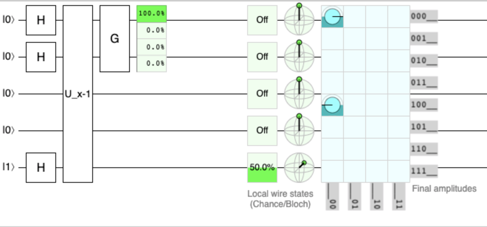
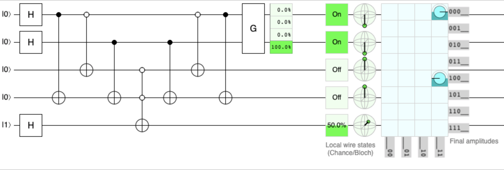
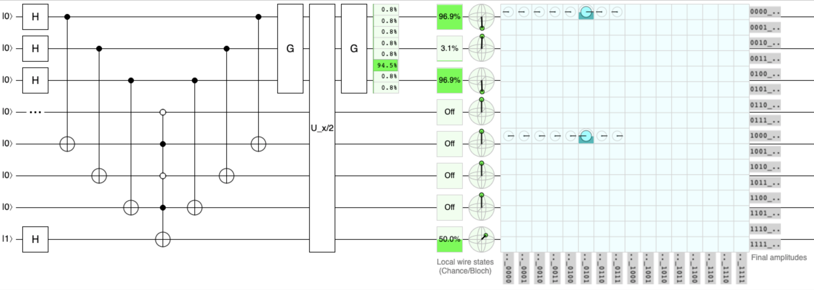
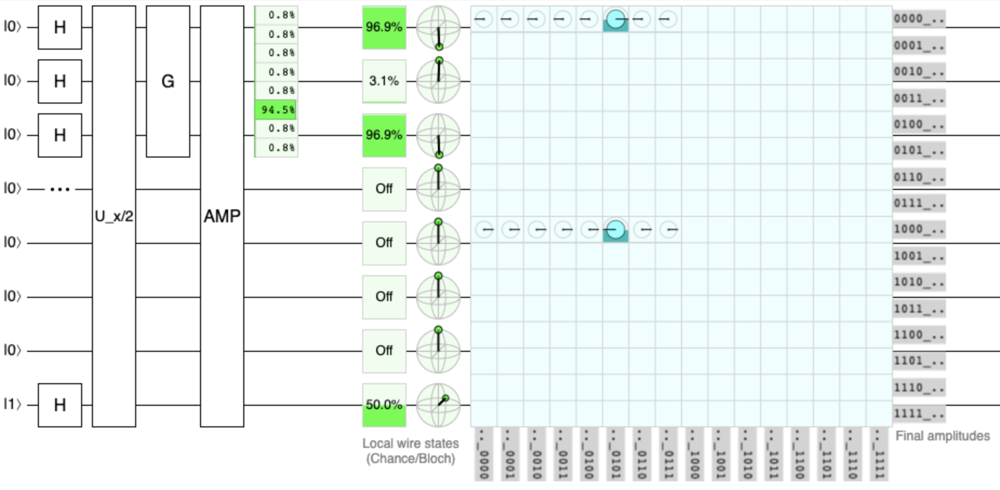
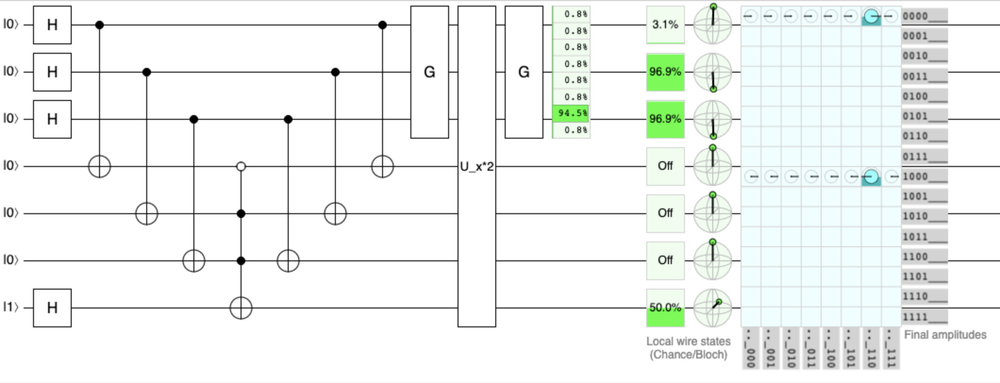
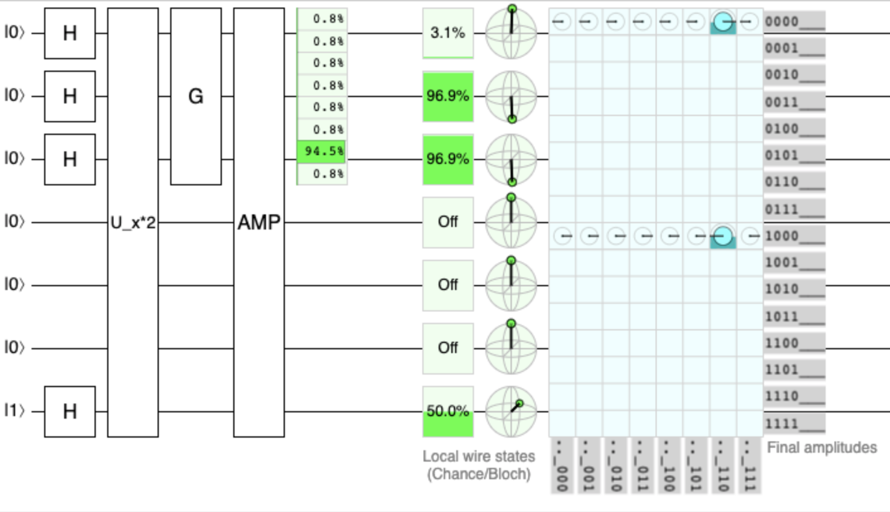

# Quantum Grover Algorithms

Following you will be able to see and understand different find algorithms in unsorted sets. The examples did it below have been done with datasets of two and three qubits. The search space will be the next in function of the qubits number, given n the space will be :

| n   | space | decimal           |
| --- | ----- | ----------------- |
| 2   | 4     | [0,1,2,3]         |
| 3   | 8     | [0,1,2,3,4,5,6,7] |

In these examples, we will go changing the oracle to identify the correct solution. The Grover function only will change in order to n.

## Table of Contents

TBD

## How to calculate the Grover function

Given n the Grover function will be:

>)

P will be a matrix (1/N) with dimension NxN being N:

For example, with n=2, N will be 4, then:

<!-- prettier-ignore -->

Then the Grover matrix will be:

<!-- prettier-ignore -->

## Algorithms with n=2

The Grover function will be...

### Given x, find x in the set

In this example the value to search is 2

[Link to the circuit](https://algassert.com/quirk#circuit=%7B%22cols%22%3A%5B%5B%22H%22%2C%22H%22%2C1%2C1%2C%22H%22%5D%2C%5B%22%E2%80%A2%22%2C1%2C%22X%22%5D%2C%5B1%2C%22%E2%80%A2%22%2C1%2C%22X%22%5D%2C%5B1%2C1%2C%22%E2%97%A6%22%2C%22%E2%80%A2%22%2C%22X%22%5D%2C%5B1%2C%22%E2%80%A2%22%2C1%2C%22X%22%5D%2C%5B%22%E2%80%A2%22%2C1%2C%22X%22%5D%2C%5B%22~8qtn%22%5D%2C%5B%22Chance2%22%5D%5D%2C%22gates%22%3A%5B%7B%22id%22%3A%22~8qtn%22%2C%22name%22%3A%22G%22%2C%22matrix%22%3A%22%7B%7B-%C2%BD%2C%C2%BD%2C%C2%BD%2C%C2%BD%7D%2C%7B%C2%BD%2C-%C2%BD%2C%C2%BD%2C%C2%BD%7D%2C%7B%C2%BD%2C%C2%BD%2C-%C2%BD%2C%C2%BD%7D%2C%7B%C2%BD%2C%C2%BD%2C%C2%BD%2C-%C2%BD%7D%7D%22%7D%5D%2C%22init%22%3A%5B0%2C0%2C0%2C0%2C1%5D%7D)

### Given x, find x-1 in the set

=x-1>)

Being x equal to 1 the result to search will be 0.

[Link to the circuit](https://algassert.com/quirk#circuit=%7B%22cols%22%3A%5B%5B%22H%22%2C%22H%22%2C1%2C1%2C%22H%22%5D%2C%5B%22%E2%80%A2%22%2C1%2C1%2C%22X%22%5D%2C%5B%22%E2%97%A6%22%2C1%2C%22X%22%5D%2C%5B1%2C%22%E2%80%A2%22%2C1%2C%22X%22%5D%2C%5B1%2C1%2C%22%E2%80%A2%22%2C%22%E2%97%A6%22%2C%22X%22%5D%2C%5B1%2C%22%E2%80%A2%22%2C1%2C%22X%22%5D%2C%5B%22%E2%97%A6%22%2C1%2C%22X%22%5D%2C%5B%22%E2%80%A2%22%2C1%2C1%2C%22X%22%5D%2C%5B%22~bp8a%22%5D%2C%5B%22Chance2%22%5D%5D%2C%22gates%22%3A%5B%7B%22id%22%3A%22~bp8a%22%2C%22name%22%3A%22G%22%2C%22matrix%22%3A%22%7B%7B-%C2%BD%2C%C2%BD%2C%C2%BD%2C%C2%BD%7D%2C%7B%C2%BD%2C-%C2%BD%2C%C2%BD%2C%C2%BD%7D%2C%7B%C2%BD%2C%C2%BD%2C-%C2%BD%2C%C2%BD%7D%2C%7B%C2%BD%2C%C2%BD%2C%C2%BD%2C-%C2%BD%7D%7D%22%7D%5D%2C%22init%22%3A%5B0%2C0%2C0%2C0%2C1%5D%7D)

> Note: to x equal to 0, the result will be 3

### Given x, find x+1 in the set

TBD

## Algorithms with n=3

### Given x, find x in the set

TBD

### Given x, find x/2 in the set

=x/2>)

Being x equal to 10 the result to search will be 5.

[Link to the circuit](https://algassert.com/quirk#circuit=%7B%22cols%22%3A%5B%5B%22H%22%2C%22H%22%2C%22H%22%2C%22%E2%80%A6%22%2C1%2C1%2C1%2C%22H%22%5D%2C%5B%22%E2%80%A2%22%2C1%2C1%2C1%2C%22X%22%5D%2C%5B1%2C%22%E2%80%A2%22%2C1%2C1%2C1%2C%22X%22%5D%2C%5B1%2C1%2C%22%E2%80%A2%22%2C1%2C1%2C1%2C%22X%22%5D%2C%5B1%2C1%2C1%2C%22%E2%97%A6%22%2C%22%E2%80%A2%22%2C%22%E2%97%A6%22%2C%22%E2%80%A2%22%2C%22X%22%5D%2C%5B1%2C1%2C%22%E2%80%A2%22%2C1%2C1%2C1%2C%22X%22%5D%2C%5B1%2C%22%E2%80%A2%22%2C1%2C1%2C1%2C%22X%22%5D%2C%5B%22%E2%80%A2%22%2C1%2C1%2C1%2C%22X%22%5D%2C%5B%22~h479%22%5D%2C%5B%22~mp3p%22%5D%2C%5B%22~h479%22%5D%2C%5B%22Chance3%22%5D%5D%2C%22gates%22%3A%5B%7B%22id%22%3A%22~h479%22%2C%22name%22%3A%22G%22%2C%22matrix%22%3A%22%7B%7B-%C2%BE%2C%C2%BC%2C%C2%BC%2C%C2%BC%2C%C2%BC%2C%C2%BC%2C%C2%BC%2C%C2%BC%7D%2C%7B%C2%BC%2C-%C2%BE%2C%C2%BC%2C%C2%BC%2C%C2%BC%2C%C2%BC%2C%C2%BC%2C%C2%BC%7D%2C%7B%C2%BC%2C%C2%BC%2C-%C2%BE%2C%C2%BC%2C%C2%BC%2C%C2%BC%2C%C2%BC%2C%C2%BC%7D%2C%7B%C2%BC%2C%C2%BC%2C%C2%BC%2C-%C2%BE%2C%C2%BC%2C%C2%BC%2C%C2%BC%2C%C2%BC%7D%2C%7B%C2%BC%2C%C2%BC%2C%C2%BC%2C%C2%BC%2C-%C2%BE%2C%C2%BC%2C%C2%BC%2C%C2%BC%7D%2C%7B%C2%BC%2C%C2%BC%2C%C2%BC%2C%C2%BC%2C%C2%BC%2C-%C2%BE%2C%C2%BC%2C%C2%BC%7D%2C%7B%C2%BC%2C%C2%BC%2C%C2%BC%2C%C2%BC%2C%C2%BC%2C%C2%BC%2C-%C2%BE%2C%C2%BC%7D%2C%7B%C2%BC%2C%C2%BC%2C%C2%BC%2C%C2%BC%2C%C2%BC%2C%C2%BC%2C%C2%BC%2C-%C2%BE%7D%7D%22%7D%2C%7B%22id%22%3A%22~mp3p%22%2C%22name%22%3A%22U_x%2F2%22%2C%22circuit%22%3A%7B%22cols%22%3A%5B%5B%22%E2%80%A2%22%2C1%2C1%2C1%2C%22X%22%5D%2C%5B1%2C%22%E2%80%A2%22%2C1%2C1%2C1%2C%22X%22%5D%2C%5B1%2C1%2C%22%E2%80%A2%22%2C1%2C1%2C1%2C%22X%22%5D%2C%5B1%2C1%2C1%2C%22%E2%97%A6%22%2C%22%E2%80%A2%22%2C%22%E2%97%A6%22%2C%22%E2%80%A2%22%2C%22X%22%5D%2C%5B1%2C1%2C%22%E2%80%A2%22%2C1%2C1%2C1%2C%22X%22%5D%2C%5B1%2C%22%E2%80%A2%22%2C1%2C1%2C1%2C%22X%22%5D%2C%5B%22%E2%80%A2%22%2C1%2C1%2C1%2C%22X%22%5D%5D%7D%7D%5D%2C%22init%22%3A%5B0%2C0%2C0%2C0%2C0%2C0%2C0%2C1%5D%7D)

### Given x, find x\*2 in the set

=x*2>)

Being x equal to 3 the result to search will be 6.

[Link to the circuit](https://algassert.com/quirk#circuit=%7B%22cols%22%3A%5B%5B%22H%22%2C%22H%22%2C%22H%22%2C1%2C1%2C1%2C%22H%22%5D%2C%5B%22%E2%80%A2%22%2C1%2C1%2C%22X%22%5D%2C%5B1%2C%22%E2%80%A2%22%2C1%2C1%2C%22X%22%5D%2C%5B1%2C1%2C%22%E2%80%A2%22%2C1%2C1%2C%22X%22%5D%2C%5B1%2C1%2C1%2C%22%E2%97%A6%22%2C%22%E2%80%A2%22%2C%22%E2%80%A2%22%2C%22X%22%5D%2C%5B1%2C1%2C%22%E2%80%A2%22%2C1%2C1%2C%22X%22%5D%2C%5B1%2C%22%E2%80%A2%22%2C1%2C1%2C%22X%22%5D%2C%5B%22%E2%80%A2%22%2C1%2C1%2C%22X%22%5D%2C%5B%22~gjh4%22%5D%2C%5B%22~9kak%22%5D%2C%5B%22~gjh4%22%5D%2C%5B%22Chance3%22%5D%5D%2C%22gates%22%3A%5B%7B%22id%22%3A%22~gjh4%22%2C%22name%22%3A%22G%22%2C%22matrix%22%3A%22%7B%7B-%C2%BE%2C%C2%BC%2C%C2%BC%2C%C2%BC%2C%C2%BC%2C%C2%BC%2C%C2%BC%2C%C2%BC%7D%2C%7B%C2%BC%2C-%C2%BE%2C%C2%BC%2C%C2%BC%2C%C2%BC%2C%C2%BC%2C%C2%BC%2C%C2%BC%7D%2C%7B%C2%BC%2C%C2%BC%2C-%C2%BE%2C%C2%BC%2C%C2%BC%2C%C2%BC%2C%C2%BC%2C%C2%BC%7D%2C%7B%C2%BC%2C%C2%BC%2C%C2%BC%2C-%C2%BE%2C%C2%BC%2C%C2%BC%2C%C2%BC%2C%C2%BC%7D%2C%7B%C2%BC%2C%C2%BC%2C%C2%BC%2C%C2%BC%2C-%C2%BE%2C%C2%BC%2C%C2%BC%2C%C2%BC%7D%2C%7B%C2%BC%2C%C2%BC%2C%C2%BC%2C%C2%BC%2C%C2%BC%2C-%C2%BE%2C%C2%BC%2C%C2%BC%7D%2C%7B%C2%BC%2C%C2%BC%2C%C2%BC%2C%C2%BC%2C%C2%BC%2C%C2%BC%2C-%C2%BE%2C%C2%BC%7D%2C%7B%C2%BC%2C%C2%BC%2C%C2%BC%2C%C2%BC%2C%C2%BC%2C%C2%BC%2C%C2%BC%2C-%C2%BE%7D%7D%22%7D%2C%7B%22id%22%3A%22~9kak%22%2C%22name%22%3A%22U_x*2%22%2C%22circuit%22%3A%7B%22cols%22%3A%5B%5B%22%E2%80%A2%22%2C1%2C1%2C%22X%22%5D%2C%5B1%2C%22%E2%80%A2%22%2C1%2C1%2C%22X%22%5D%2C%5B1%2C1%2C%22%E2%80%A2%22%2C1%2C1%2C%22X%22%5D%2C%5B1%2C1%2C1%2C%22%E2%97%A6%22%2C%22%E2%80%A2%22%2C%22%E2%80%A2%22%2C%22X%22%5D%2C%5B1%2C1%2C%22%E2%80%A2%22%2C1%2C1%2C%22X%22%5D%2C%5B1%2C%22%E2%80%A2%22%2C1%2C1%2C%22X%22%5D%2C%5B%22%E2%80%A2%22%2C1%2C1%2C%22X%22%5D%5D%7D%7D%5D%2C%22init%22%3A%5B0%2C0%2C0%2C0%2C0%2C0%2C1%5D%7D)
